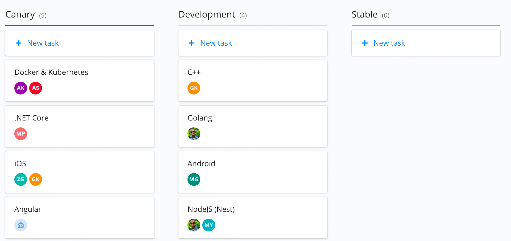

# Overview

At Scalio, a primary goal for 2019 is to move 100% of our application builds over to Bazel - every language & platform. This work has already begun for many of the platforms we ship code for, and this document tracks the status of this effort here at Scalio, as well as serves as an example of our typical strategy when moving organizations over to Bazel.

# Playbook

We execute this process using a standard playbook both internally here on our projects and when engaged by clients to help with this effort.

The workflow consists of 3 stages, each of which consists of a few steps. The stages align to our level of support and adoption of Bazel for a given platform or language.

## Status Workflow

- 🔴 **Canary** - _proof of concept phase_
  - evaluate existing support for Bazel
  - initial creation of toolchains, build rules drafts
  - initial definition of knowledgebase and internal best practices
  - begin onboarding the platform team "early adopters"
- 💛 **Development** - _building out full Bazel support_
  - refine build rules
  - define boilerplate project workspaces (BUILD files) for projects on this platform
  - build all new projects on this platform with bazel
  - continue migration process
  - finalize best practices and knowledgebase
  - platform team fully onboarded
  - PRs to Bazel OSS repos with necessary changes to the tool itself, build rules, and docs
- 💚 **Stable** - _builds with Bazel are fully supported and the norm for the platform_
  - 100% of projects building on Bazel
  - all current use cases supported

In practice, the Bazel rollout is tracked using Kanban and the above workflow, where each platform is a task, each item above is a checklist item, and each Status is a column.

# Bazel Support Status at Scalio

## 💚 Golang

All Golang applications are built with Bazel.

### Links and Resources

Todo

## 💛 NodeJS (Nest)

New NestJS apps are built with Bazel, and the team is being onboarded rapidly.

### Links and Resources

Todo

## 🔴 Angular 8

Angular builds on Bazel are being evaluated and the tooling implemented.

### Links and Resources

Todo

## 💛 Docker

Docker and Bazel support is in use for all Golang apps and some NestJS apps. Rollout is ongoing to legacy applications.

### Links and Resources

Todo

## 💛 Android

Overview todo

### Links and Resources

- [Bazel-Android-Starter](https://github.com/scalio/Bazel-Android-Sample) - A Bazel & Android starter project running latest Kotlin with coroutines support, and also Android Databinding.
- [Kotlin Build Rules](https://github.com/mig35/rules_kotlin) - our updated Kotlin build rules with full support for Kotlin 1.3, Coroutines, and Annotations.

## 🔴 iOS

Our iOS support is in canary phase as we continue to work on tooling around package managers (SPM, CocoaPods) etc.

### Links and Resources

[PodToBuild by Pinterest](https://github.com/pinterest/PodToBUILD) - A promising and useful tool for making use of CocoaPods within Bazel builds, however there's still room for improvement here, and SPM should be preferred wherever possible.

## 💛 C++

### 💛 Djinni

Overview todo

#### Links and Resources

Todo

## 💛 Rust

Overview todo

### Links and Resources

Todo

## 🔴 .NET Core

Overview todo

### Links and Resources

Todo

## 🔴 JVM

Overview todo

### Links and Resources

Todo