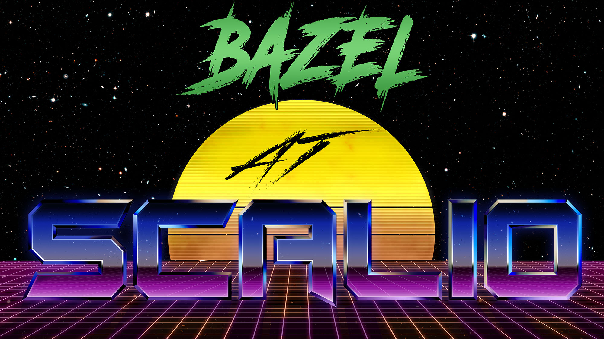
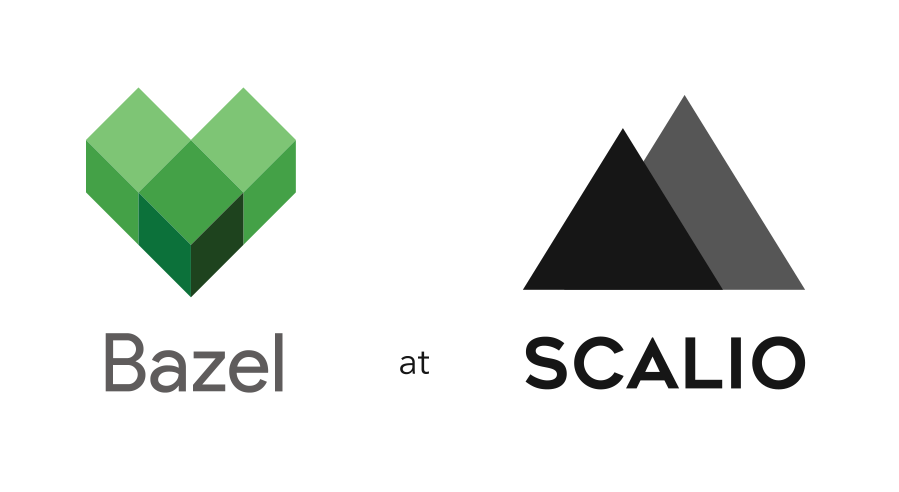

//

# Overview

At Scalio, a primary goal for 2019 is to move 100% of our application builds over to Bazel - every language & platform. This work has already begun for many of the platforms we ship code for, and this document tracks the status of this effort here at Scalio, as well as serves as an example of our typical strategy when moving organizations over to Bazel.

# Playbook

We execute this process using a standard playbook both internally here on our projects and when engaged by clients to help with this effort.

The workflow consists of 3 stages, each of which consists of a few steps. The stages align to our level of support and adoption of Bazel for a given platform or language.

## Status Workflow

- 🔴 **Canary** - _proof of concept phase_
  - evaluate existing support for Bazel
  - initial creation of toolchains, build rules drafts
  - initial definition of knowledgebase and internal best practices
  - begin onboarding the platform team "early adopters"
- 💛 **Development** - _building out full Bazel support_
  - refine build rules
  - define boilerplate project workspaces (BUILD files) for projects on this platform
  - build all new projects on this platform with bazel
  - continue migration process
  - finalize best practices and knowledgebase
  - platform team fully onboarded
  - PRs to Bazel OSS repos with necessary changes to the tool itself, build rules, and docs
  - implement remote cache integration
  - implement rbe integration
- 💚 **Stable** - _builds with Bazel are fully supported and the norm for the platform_
  - 100% of projects building on Bazel
  - all current use cases supported

In practice, the Bazel rollout is tracked using Kanban and the above workflow, where each platform is a task, each item above is a checklist item, and each Status is a column.

Scalio's live Bazel rollout kanban can be [seen here](https://github.com/scalio/bazel-status/projects/1).

# Bazel Support Status at Scalio

## 💚 Golang

All Golang applications are built with Bazel and the platform teams are fully onboarded and up to speed on our best practices.

### Issues

- [Missing $GOPATH with pure="on" enabled](https://github.com/bazelbuild/rules_go/issues/1987)

### Links and Resources

Scalio's contributions to Golang + Bazel will be publicly listed here soon.

## 💚 NodeJS (Nest)

New NestJS apps are built with Bazel, and the team is being onboarded rapidly.

### Links and Resources

- [Issues and recipes](rules_nodejs.md)

- [NestJS starter repo](https://github.com/scalio/bazel-nestjs-starter)

## 💛 Angular 8

Angular builds on Bazel are being evaluated and the tooling implemented.

### Links and Resources

Scalio's contributions to Angular + Bazel will be publicly listed here soon.

## 💚 Docker

Docker and Bazel support is in use for all Golang apps and some NestJS apps. Rollout is ongoing to legacy applications.

### Issues:

- `rules_docker` is kind of broken for Windows (under WSL too). Build works, run does not: https://github.com/bazelbuild/rules_docker/pull/1021 

### Links and Resources

Scalio's contributions to Docker + Bazel will be publicly listed here soon.

## 💛 Android

Some Android apps are built with Bazel using a custom build rule which implements support for Kotlin 1.3, but the issues below are blockin us from fully adopting Bazel for Android.

### Issues

[Android DataBinding support](https://github.com/bazelbuild/bazel/issues/2694) is a critical feature for us, used in the majority of our applciations to achieve clean MVVM architecture in line with best practices. The lack of databinding support is very problematic.

### Links and Resources

- [Bazel-Android-Starter-Kotlin](https://github.com/scalio/Android-Bazel-Starter-Kotlin) - A Bazel & Android starter project running latest Kotlin (1.3.+) with coroutines support.
- [Bazel-Android-Starter-Java](https://github.com/scalio/Android-Bazel-Starter-Java) - A Bazel & Android starter project running Java.
- [Kotlin Build Rules](https://github.com/mig35/rules_kotlin) - our updated Kotlin build rules with full support for Kotlin 1.3, Coroutines, and Annotations.

## 🔴 iOS

iOS support at Scalio is still considered *canary* as we continue to work on tooling around package managers (SPM, CocoaPods) etc.

We've had success building smaller-scale applications with Bazel, but for larger, real-world applications there's still a lot of ground to cover before we can fully migrate all of our projects to Bazel or recommend this to clients.

We are working on solidifying our internal best practices for the iOS/MacOS development process with Bazel and considering releasing some of our internal tooling that might be of use to the community.

### Links and Resources

[PodToBuild by Pinterest](https://github.com/pinterest/PodToBUILD) - A promising and useful tool for making use of CocoaPods within Bazel builds, however there's still room for improvement here, and SPM should be preferred wherever possible.

[XCHammer by Pinterest](https://github.com/pinterest/xchammer) - XCHammer generates Xcode projects from a Bazel Workspace.

## 💚 C++

Bazel is used for all new C++ projects, all meaningful legacy projects have been updated, and the team is onboarded.

Due to the great support for C++ which Bazel has out of the box, we've had almost no issues migrating from Buck to Bazel, and Bazel is now the build tool of choice for C/C++ projects at Scalio.

At Scalio, a primary use-case for C/C++ is sharing code between mobile platforms and command line tools that run on many platforms. The Bazel C++ rule's cross-compilation works well and we've successfully integrated this rule with the JVM, iOS, MacOS X (Swift) and Android platforms and their respective build rules.

We are working on open-sourcing some of our CMake + Bazel tools in the near future!

### 💛 Djinni

Due to our heavy use of C/C++ libraries for cross-platform development, strong tooling for cross-language communication is critical. For the majority of these projects, we leverage Djinni for cross-language type declarations, interface bindings, & code generation.

Bazel has great support for many of the same platforms as Djinni, and with a bit of effort, we've created some proof-of-concept Bazel build rules for Djinni interface definition files. There's been a few bumps along the way, but we now have working build rules, thanks to the power of Bazel's  [repository_rules](https://docs.bazel.build/versions/master/skylark/repository_rules.html). We plan to publish more on this very soon.

#### Links and Resources

[Djinni by Dropbox](https://github.com/dropbox/djinni) - Djinni is a tool for generating cross-language type declarations and interface bindings

Scalio's contributions to C++ & Djinni + Bazel will be publicly listed here soon.

## 🔴 Rust

Bazel and Rust work well together for simple use-cases such as example apps, but real-world support is something we're still working on, specifically around issues with Cargo integration. This is something we're searching for a good solution on as we formalize our best practices.

We hope to have more to share on this soon, as Rust is a powerful and important tool for us here at Scalio.

### Links and Resources

Scalio's contributions to Rust + Bazel will be publicly listed here soon.

## 💛 .NET Core

Scalio's .NET Core team is happy with the results we've seen with Bazel so far and full production-ready Bazel support is coming soon.

### Links and Resources

- [.NET Core starter repo](https://github.com/scalio/bazel-dotnetcore-starter)

## 💛 JVM

Java rules are supported out of the box in Bazel and solid Scala/Kotlin rules have been created by the community.

The JVM team has had success building prototype Java/Scala/Kotlin projects with Bazel and we've moved on to larger-scale projects based on Spring and similar frameworks and expect to achieve full production-ready status in the coming weeks.

### Links and Resources

Scalio's contributions to JVM + Bazel will be publicly listed here soon.
